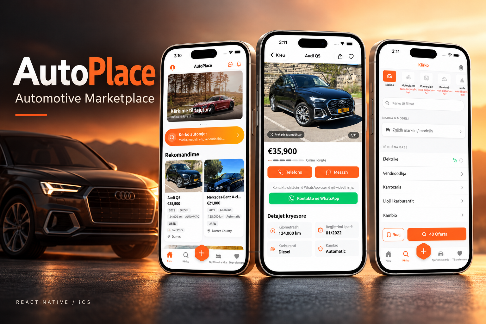
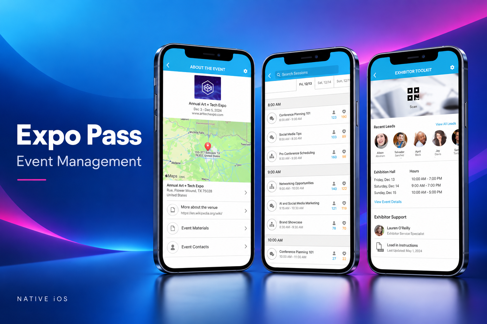
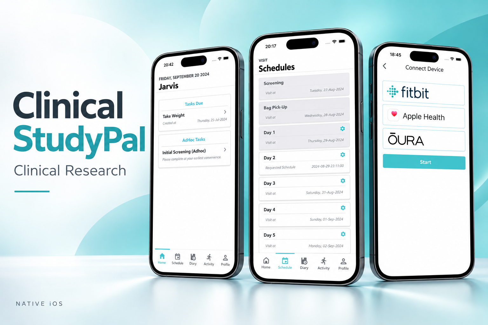
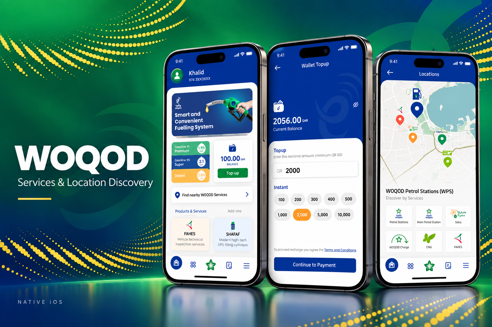
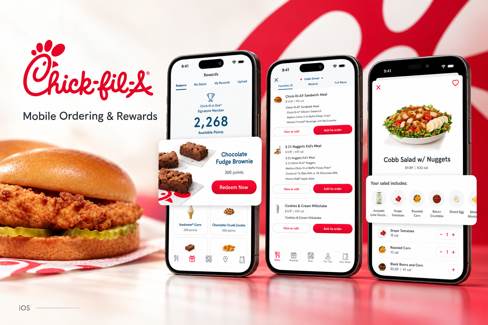
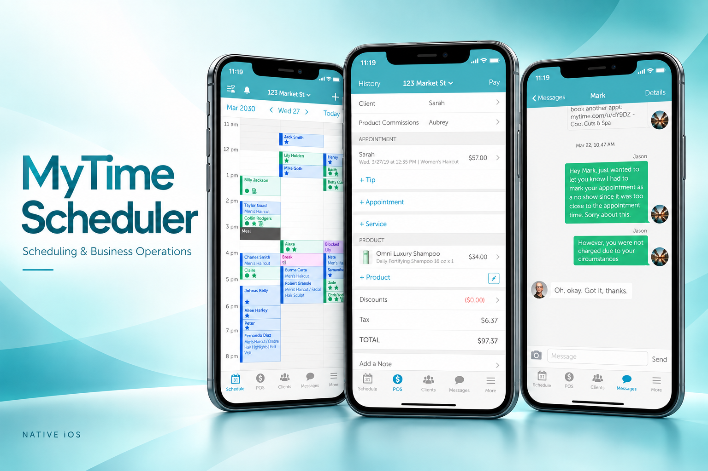
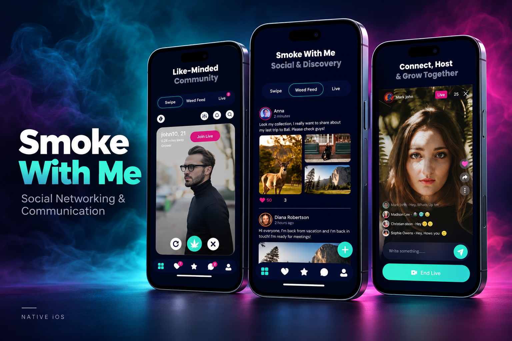
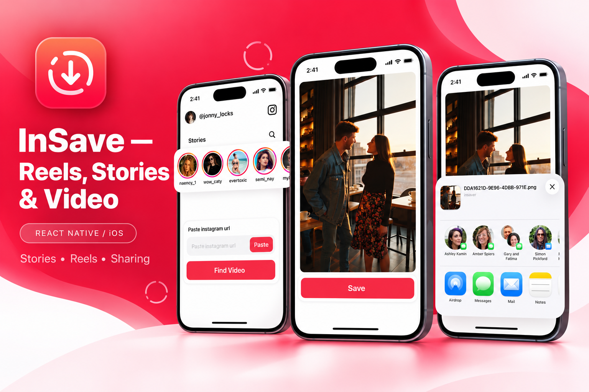

# Zaigham Farid

### Senior Mobile & Product Engineer

**iOS · Swift · SwiftUI · Flutter · React Native · Mobile Architecture · Product Delivery**

 

 

---

## Profile

I am a **Senior Mobile & Product Engineer with 6+ years of professional experience** designing, building, and delivering production applications across **iOS, iPadOS, watchOS, Flutter, and React Native**.

My strongest specialization is native Apple development with **Swift, SwiftUI, and UIKit**, complemented by extensive cross-platform experience and hands-on ownership of complete digital products.

A significant part of my work goes beyond feature development. I work across the complete product lifecycle:

### Idea → Product Definition → Architecture → Development → Integration → QA → Store Release → Production

I have worked with startups, product companies, and engineering teams across **marketplaces, healthcare, wearables, event technology, payments, media, automotive, fleet management, travel, and enterprise applications**.

### What I Bring

▸ End-to-end mobile product ownership
▸ Native iOS, iPadOS, and watchOS engineering
▸ Flutter and React Native production development
▸ Mobile architecture and technical leadership
▸ Offline-first and synchronization-heavy systems
▸ Payment, subscription, and monetization workflows
▸ HealthKit, CoreMotion, and Apple Watch development
▸ ARKit and LiDAR-based applications
▸ Production debugging, monitoring, and optimization
▸ App Store and Google Play delivery

---

# Projects

Production mobile products across native iOS, watchOS, Flutter, and React Native. Open a project to explore its feature gallery, engineering contributions, technologies, and store links.

<table>
<tr>
<td width="33%" valign="top"> <strong><a href="projects/autoplace/README.md">AutoPlace</a></strong> Automotive marketplace connecting vehicle buyers, private sellers, and dealerships. <a href="projects/autoplace/README.md">View project →</a></td>
<td width="33%" valign="top"> <strong><a href="projects/dirtconnect/README.md">DirtConnect</a></strong> Australian construction marketplace for discovering and exchanging construction materials. <a href="projects/dirtconnect/README.md">View project →</a></td>
<td width="33%" valign="top"> <strong><a href="projects/expo-pass/README.md">Expo Pass</a></strong> Event-management platform combining offline operations, payments, and hardware integrations. <a href="projects/expo-pass/README.md">View project →</a></td>
</tr>
<tr>
<td width="33%" valign="top"> <strong><a href="projects/clinical-studypal/README.md">Clinical StudyPal</a></strong> Clinical research ecosystem connecting iPhone, Apple Watch, wearable sensors, and health data. <a href="projects/clinical-studypal/README.md">View project →</a></td>
<td width="33%" valign="top"> <strong><a href="projects/clinical-studypal-iwatch/README.md">Multi-Platform Synchronization Engine</a></strong> ### Architecture · Concurrency · Offline-First Systems

Designed a **state-aware synchronization architecture** supporting applications operating across:

&lt;div align=&quot;center&quot;&gt;

`iPhone` · `iPad` · `macOS` · `Android` · `Web` · `Kiosk`

&lt;/div&gt;

**Engineering Highlights**

▸ Server-state validation
▸ Periodic synchronization
▸ Conflict-safe outbound updates
▸ Network-state awareness
▸ Retry strategies
▸ Offline persistence
▸ Concurrent operation management
▸ Background processing
▸ Cross-platform state coordination

**Stack:** `Swift` `OperationQueue` `Swift Concurrency` `REST APIs` `CoreData`

---

## iPad LiDAR Measurement System

### ARKit · LiDAR · Precision Interaction

Built an iPad-focused real-world measurement workflow using **ARKit and LiDAR**.

**Engineering Highlights**

▸ LiDAR-based dimensional measurement
▸ ARKit scene processing
▸ Interactive measurement overlays
▸ Draggable measurement endpoints
▸ Camera-space coordinate handling
▸ Real-time visualization
▸ Measurement calculations in inches
▸ Precision-focused touch interaction

**Stack:** `Swift` `SwiftUI` `UIKit` `ARKit` `RealityKit` `LiDAR`

---

# Production Portfolio

A selection of production products I have worked on across **native iOS, watchOS, React Native, and Flutter**.

| Product                            | Domain / Engineering                   | Platform                                                                                                                                                                   |
| ---------------------------------- | -------------------------------------- | -------------------------------------------------------------------------------------------------------------------------------------------------------------------------- |
| **AutoPlace**                      | End-to-End Automotive Marketplace      | [App Store](https://apps.apple.com/us/app/autoplace-al-makina-n%C3%AB-shitje/id6753959493) · [Google Play](https://play.google.com/store/apps/details?id=al.autoplace.app) |
| **DirtConnect**                    | End-to-End Construction Marketplace    | [Google Play](https://play.google.com/store/apps/details?id=com.dirt.connect)                                                                                              |
| **Expo Pass**                      | Events · Offline · Payments · Hardware | [App Store](https://apps.apple.com/us/app/expo-pass/id921625648)                                                                                                           |
| **Clinical StudyPal**              | Healthcare · Clinical Research         | [App Store](https://apps.apple.com/us/app/clinical-studypal/id1537595111)                                                                                                  |
| **Clinical StudyPal iWatch**       | watchOS · HealthKit · Sensors          | [App Store](https://apps.apple.com/us/app/clinical-studypal-iwatch/id1544172407)                                                                                           |
| **WOQOD**                          | Native iOS · Services · Maps           | [App Store](https://apps.apple.com/us/app/woqod/id1403430375)                                                                                                              |
| **CVS Health**                     | Healthcare · SDKs · Authentication     | [App Store](https://apps.apple.com/us/app/cvs-health/id395545555)                                                                                                          |
| **Chick-fil-A**                    | Ordering · Delivery · Notifications    | [App Store](https://apps.apple.com/us/app/chick-fil-a/id488818252)                                                                                                         |
| **MyTime Scheduler for Merchants** | Scheduling · Business Operations       | [App Store](https://apps.apple.com/pk/app/mytime-scheduler-for-merchants/id982024232)                                                                                      |
| **Smoke With Me**                  | Social Networking · Communication      | [App Store](https://apps.apple.com/us/app/smoke-with-me/id6741205102)                                                                                                      |

---

## Clinical StudyPal iWatch

Apple Watch companion for clinical research, study participation, and connected health workflows. <a href="projects/clinical-studypal-iwatch/README.md">View project →</a></td>
<td width="33%" valign="top"> <strong><a href="projects/woqod/README.md">WOQOD</a></strong> Native iOS services application with service discovery and location-based experiences. <a href="projects/woqod/README.md">View project →</a></td>
</tr>
<tr>
<td width="33%" valign="top"> <strong><a href="projects/cvs-health/README.md">CVS Health</a></strong> Healthcare application supporting prescription management, rewards, and shopping workflows. <a href="projects/cvs-health/README.md">View project →</a></td>
<td width="33%" valign="top"> <strong><a href="projects/chick-fil-a/README.md">Chick-fil-A</a></strong> Mobile ordering application with rewards, order customization, and delivery experiences. <a href="projects/chick-fil-a/README.md">View project →</a></td>
<td width="33%" valign="top"> <strong><a href="projects/mytime/README.md">MyTime Scheduler for Merchants</a></strong> Business scheduling application with appointments, point-of-sale, and client communication. <a href="projects/mytime/README.md">View project →</a></td>
</tr>
<tr>
<td width="33%" valign="top"> <strong><a href="projects/smoke-with-me/README.md">Smoke With Me</a></strong> Social networking application for community discovery, social feeds, and live sessions. <a href="projects/smoke-with-me/README.md">View project →</a></td>
<td width="33%" valign="top"> <strong><a href="projects/music-player/README.md">React Native Media Suite</a></strong> Worked as a **Senior React Native Developer** across a suite of production media applications involving frontend rebuilds, API integrations, media workflows, subscriptions, performance optimization, and App Store delivery.

| Application                         | Store                                                                                      |
| ----------------------------------- | ------------------------------------------------------------------------------------------ |
| **Music Player — Songs &amp; Videos**   | [View on App Store](https://apps.apple.com/us/app/music-player-songs-videos/id1662272925)  |
| **Offline Music Player**            | [View on App Store](https://apps.apple.com/us/app/offline-music-player/id1259949354)       |
| **Myt — Videos &amp; Songs Streaming**  | [View on App Store](https://apps.apple.com/us/app/myt-videos-songs-streaming/id6738610571) |
| **InSave — Reels, Stories &amp; Video** | [View on App Store](https://apps.apple.com/us/app/insave-reels-stories-video/id6599859154) |
| **SaveTik — Save Tik Videos**       | [View on App Store](https://apps.apple.com/us/app/savetik-save-tik-videos/id6774569640)    |

**Engineering Focus**

`React Native` · `API Integration` · `Media Playback` · `Subscriptions` · `State Management` · `Performance` · `Production Delivery`

---

## Music Player — Songs &amp; Videos

Music and video application with discovery, playback, and a personal media library. <a href="projects/music-player/README.md">View project →</a></td>
<td width="33%" valign="top"> <strong><a href="projects/offline-music-player/README.md">Offline Music Player</a></strong> Music application with offline listening, smart playlists, and audio equalizer controls. <a href="projects/offline-music-player/README.md">View project →</a></td>
</tr>
<tr>
<td width="33%" valign="top"> <strong><a href="projects/myt/README.md">Myt — Videos &amp; Songs Streaming</a></strong> Music and video streaming application with discovery, search, and playback. <a href="projects/myt/README.md">View project →</a></td>
<td width="33%" valign="top"> <strong><a href="projects/insave/README.md">InSave — Reels, Stories &amp; Video</a></strong> Media utility for finding, saving, and sharing stories, reels, and videos. <a href="projects/insave/README.md">View project →</a></td>
<td width="33%" valign="top"> <strong><a href="projects/savetik/README.md">SaveTik — Save Tik Videos</a></strong> Video utility for finding videos, saving media, and organizing collections. <a href="projects/savetik/README.md">View project →</a></td>
</tr>
</table>

---

# Architecture & Specialized Engineering

## Multi-Platform Synchronization Engine

### Architecture · Concurrency · Offline-First Systems

Designed a **state-aware synchronization architecture** supporting applications operating across:

`iPhone` · `iPad` · `macOS` · `Android` · `Web` · `Kiosk`

**Engineering Highlights**

▸ Server-state validation
▸ Periodic synchronization
▸ Conflict-safe outbound updates
▸ Network-state awareness
▸ Retry strategies
▸ Offline persistence
▸ Concurrent operation management
▸ Background processing
▸ Cross-platform state coordination

**Stack:** `Swift` `OperationQueue` `Swift Concurrency` `REST APIs` `CoreData`

---

## iPad LiDAR Measurement System

### ARKit · LiDAR · Precision Interaction

Built an iPad-focused real-world measurement workflow using **ARKit and LiDAR**.

**Engineering Highlights**

▸ LiDAR-based dimensional measurement
▸ ARKit scene processing
▸ Interactive measurement overlays
▸ Draggable measurement endpoints
▸ Camera-space coordinate handling
▸ Real-time visualization
▸ Measurement calculations in inches
▸ Precision-focused touch interaction

**Stack:** `Swift` `SwiftUI` `UIKit` `ARKit` `RealityKit` `LiDAR`

---

# Technical Expertise

 

| Engineering Area      | Technologies & Experience                                                                |
| --------------------- | ---------------------------------------------------------------------------------------- |
| **Apple Development** | Swift, SwiftUI, UIKit, Combine, async/await, OperationQueue, CoreData, AVFoundation      |
| **Apple Platforms**   | iOS, iPadOS, watchOS, HealthKit, CoreMotion, WatchConnectivity, ARKit, LiDAR             |
| **Cross-Platform**    | Flutter, Dart, React Native, Expo                                                        |
| **State Management**  | BLoC, Provider, GetX, Combine                                                            |
| **Architecture**      | MVVM, Clean Architecture, Repository Pattern, Dependency Injection, Modular Architecture |
| **Backend & Data**    | REST APIs, Firebase, Firestore, Supabase, PostgreSQL, Node.js, Express, GraphQL          |
| **Cloud**             | AWS, Google Cloud, Firebase                                                              |
| **Payments**          | Stripe, Stripe Terminal, Apple Pay, StoreKit, RevenueCat                                 |
| **Security**          | Keychain, Secure Enclave, AES-GCM, Face ID, Touch ID                                     |
| **Testing**           | XCTest, XCUITest, Unit Testing, UI Testing, Dependency Mocking                           |
| **Monitoring**        | Crashlytics, Sentry, OSLog, Structured Logging                                           |
| **Delivery**          | GitHub Actions, CI/CD, TestFlight, App Store Connect, Google Play                        |
| **Tooling**           | Xcode, Git, GitHub, Postman, Jira, Figma, CocoaPods, Swift Package Manager               |

---

# Engineering Specializations

### Mobile Architecture

I design mobile systems with **clear separation of concerns, reusable services, testable business logic, modular components, and architectures that can evolve with the product**.

`MVVM` · `Clean Architecture` · `Dependency Injection` · `Repository Pattern` · `Protocol-Oriented Design`

### Offline & Synchronization

Experience designing applications that continue operating reliably under limited or unavailable connectivity.

`Local Persistence` · `Background Sync` · `Conflict Handling` · `Retry Queues` · `Network Awareness` · `Server Reconciliation`

### Payments & Monetization

`Stripe` · `Stripe Terminal` · `Apple Pay` · `StoreKit` · `RevenueCat` · `In-App Purchases` · `Subscriptions`

### Apple Watch & Sensors

`HealthKit` · `CoreMotion` · `WatchConnectivity` · `Accelerometer` · `Gyroscope` · `Heart Rate` · `Sleep Data`

### Mobile Security

`Keychain` · `Secure Enclave` · `AES-GCM` · `Face ID` · `Touch ID` · `Secure Token Storage`

### Production Quality

`XCTest` · `XCUITest` · `Crashlytics` · `Sentry` · `OSLog` · `Structured Logging` · `Production Monitoring`

---

# Professional Experience

## Independent Senior Mobile & Product Engineer

**2025 — Present**

Working directly with founders, clients, and product teams on complete mobile products and technically complex mobile engagements.

▸ End-to-end product development
▸ Mobile architecture and technical planning
▸ Native iOS engineering
▸ Flutter and React Native development
▸ Backend and API coordination
▸ Engineering estimation
▸ Code reviews and technical guidance
▸ QA and release management
▸ Production stabilization

---

## Senior Mobile Developer · US Remote Contractor

**March 2022 — October 2025**

▸ Led mobile-development initiatives and complex feature implementation
▸ Built production features using Swift, UIKit, and SwiftUI
▸ Designed networking, notification, payment, and synchronization workflows
▸ Modernized legacy applications using MVVM and modular architecture
▸ Implemented automated testing strategies
▸ Collaborated with product, backend, design, and QA teams
▸ Participated in architecture and code reviews
▸ Mentored mobile developers
▸ Managed TestFlight and App Store releases

---

## iOS Developer · Delve Health

**June 2020 — March 2022**

▸ Developed healthcare applications for iPhone and Apple Watch
▸ Integrated HealthKit and wearable sensor data
▸ Worked with accelerometer, gyroscope, heart-rate, and activity information
▸ Refactored legacy MVC code toward MVVM
▸ Implemented unit testing and Crashlytics monitoring
▸ Built push-notification and localization workflows
▸ Worked on background synchronization and health-data persistence

---

# Technical Leadership

My responsibilities frequently extend across the complete engineering lifecycle:

### Requirements → Architecture → Development → Review → QA → CI/CD → Store Release → Production

Experience includes:

▸ Technical architecture decisions
▸ Product and engineering planning
▸ Development estimation
▸ Breaking requirements into engineering tasks
▸ Code reviews
▸ Developer mentorship
▸ Mobile/backend coordination
▸ Coding standards and engineering practices
▸ Production release management
▸ Complex production debugging

---

# Education

### Master's in Software Engineering

### Bachelor of Computer Science

**National University of Computer and Emerging Sciences — FAST-NUCES**

---

# Let's Build Something That Ships

I am interested in **Senior Mobile Engineer, Senior iOS Engineer, Mobile Architect, Technical Lead, and end-to-end product engineering opportunities**.

My strongest work sits where **product ownership and deep mobile engineering meet** — taking challenging products from initial requirements through architecture, implementation, release, and production.

### Swift · SwiftUI · iOS · Flutter · React Native · Mobile Architecture · Product Engineering

 

  

<strong>Building production mobile products — from architecture and first commit to store release and production.</strong>

