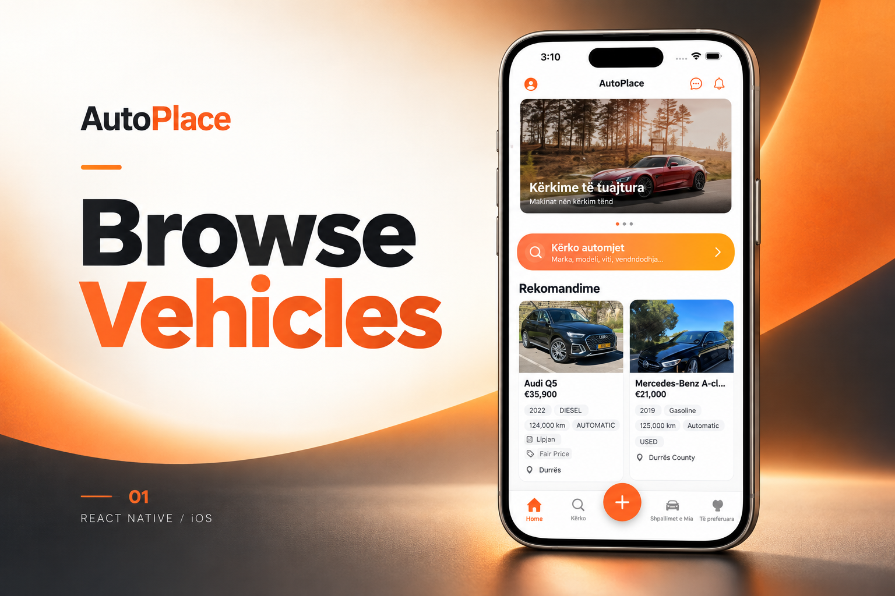
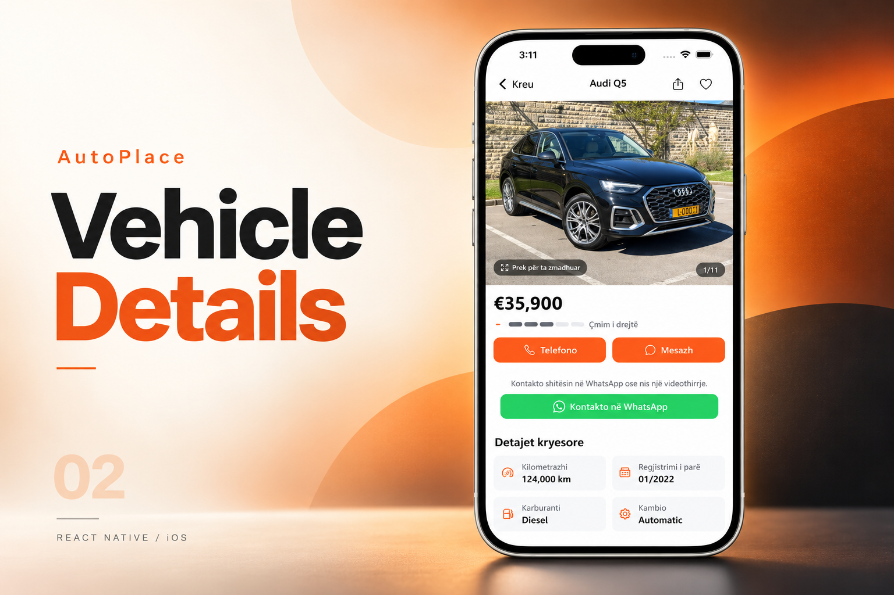
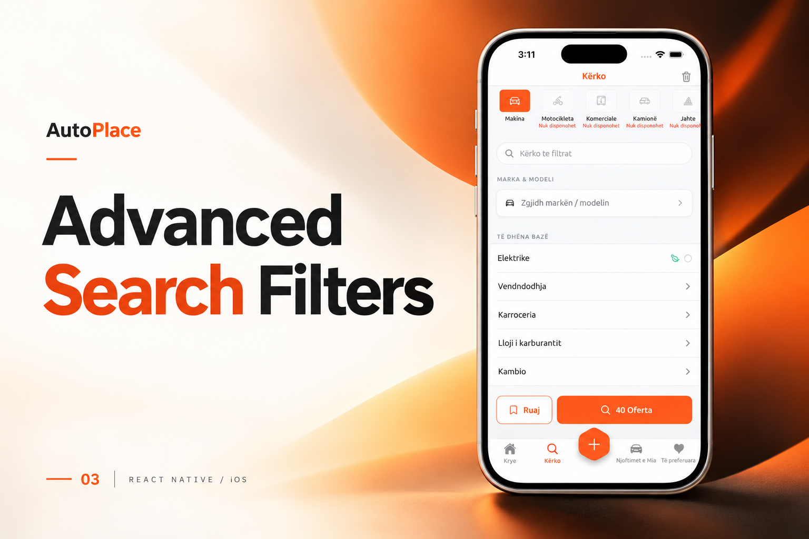

[← Back to portfolio](../../README.md#projects)

# AutoPlace

Automotive marketplace connecting vehicle buyers, private sellers, and dealerships.

### Feature Gallery

<table>
<tr>
<td width="33%" align="center"> Browse Vehicles</td>
<td width="33%" align="center"> Vehicle Details</td>
<td width="33%" align="center"> Advanced Search Filters</td>
</tr>
</table>

**Project artifacts:** [Cover](../../assets/projects/autoplace/cover.png) · [All feature images](../../assets/projects/autoplace)

### Automotive Marketplace · React Native · End-to-End Product Ownership

**AutoPlace** is a complete automotive marketplace connecting vehicle buyers, private sellers, and dealerships through an integrated mobile and web ecosystem.

I worked on the product **from idea and product definition through architecture, development, backend coordination, QA, deployment, and production delivery**.

### Product Ownership

▸ Product requirements and technical planning
▸ React Native application architecture
▸ iOS and Android application development
▸ Vehicle listing and inventory workflows
▸ Dealer and private-seller experiences
▸ Advanced search and filtering
▸ Authentication and user profiles
▸ Favorites and saved searches
▸ In-app communication workflows
▸ Location-aware functionality
▸ REST API integration
▸ Web and mobile ecosystem coordination
▸ QA and production stabilization
▸ App Store and Google Play delivery

**Core Stack**

`React Native` `TypeScript` `JavaScript` `REST APIs` `Mobile Architecture`

> **Ownership:** Idea → Requirements → Architecture → Development → Backend/Web Integration → QA → Store Release → Production
