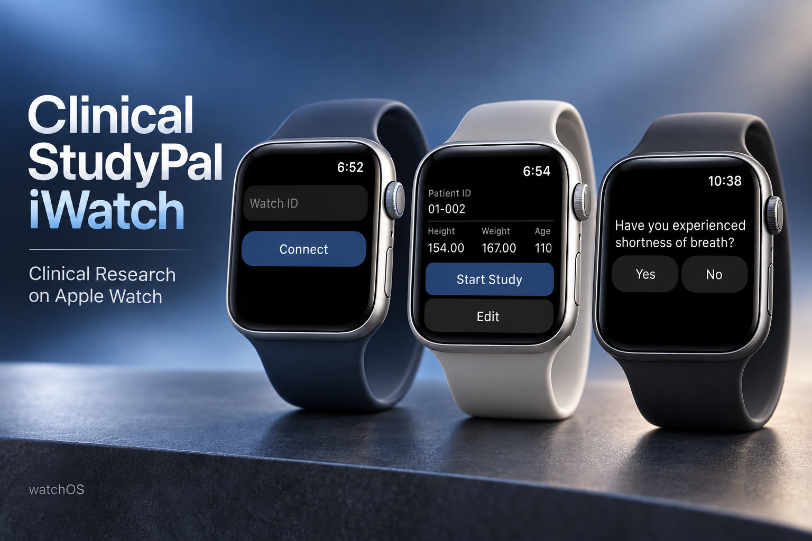
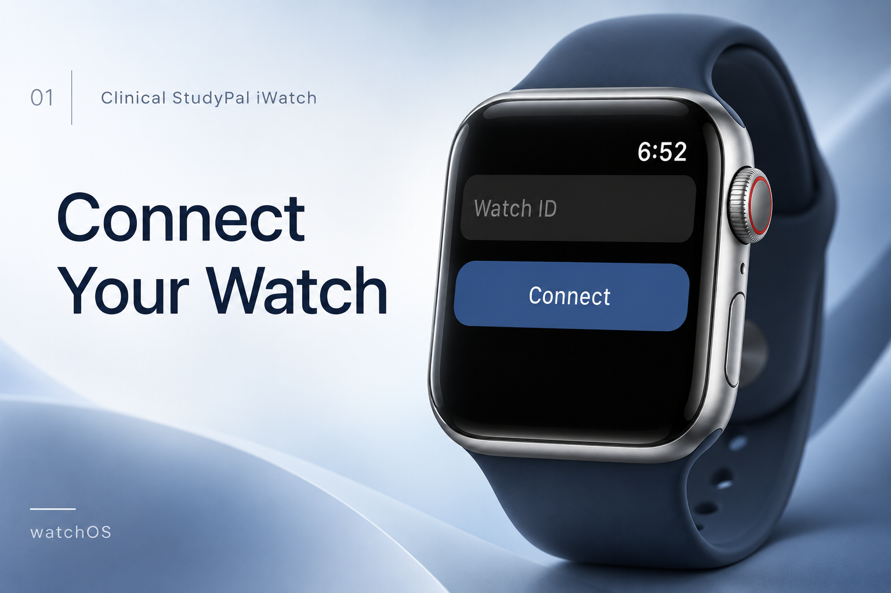
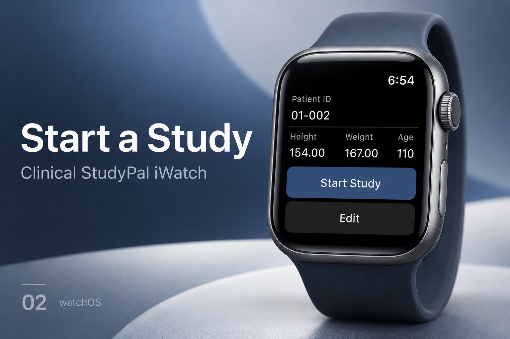
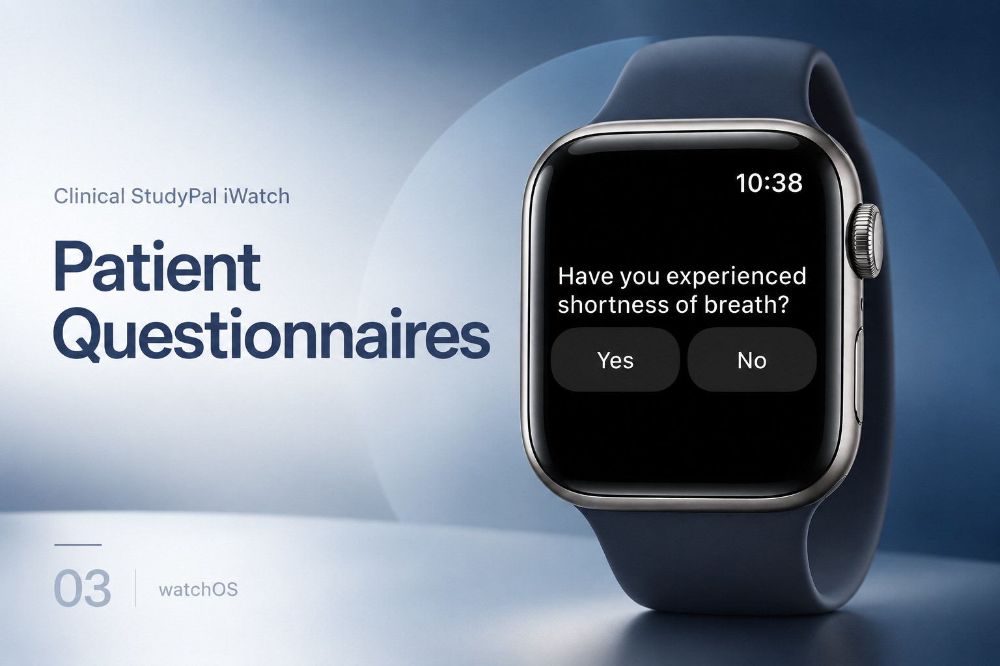

[← Back to portfolio](../../README.md#projects)

# Clinical StudyPal iWatch

Apple Watch companion for clinical research, study participation, and connected health workflows.

### Feature Gallery

<table>
<tr>
<td width="33%" align="center"> Connect Your Watch</td>
<td width="33%" align="center"> Start a Study</td>
<td width="33%" align="center"> Patient Questionnaires</td>
</tr>
</table>

**Project artifacts:** [Cover](../../assets/projects/clinical-studypal-iwatch/cover.png) · [All feature images](../../assets/projects/clinical-studypal-iwatch)

**Engineering contribution:** watchOS development, HealthKit, wearable sensors, WatchConnectivity, and background synchronization.

**Store links:** [App Store](https://apps.apple.com/us/app/clinical-studypal-iwatch/id1544172407)
