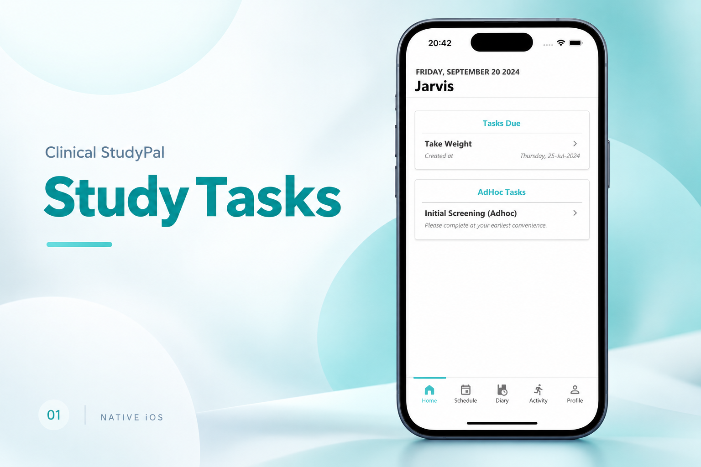
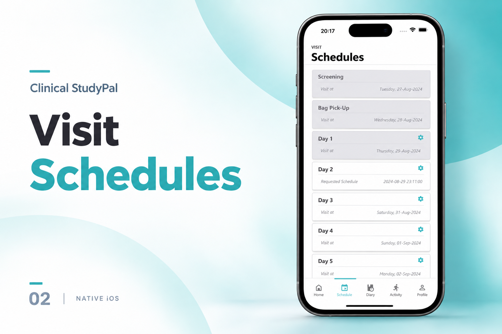
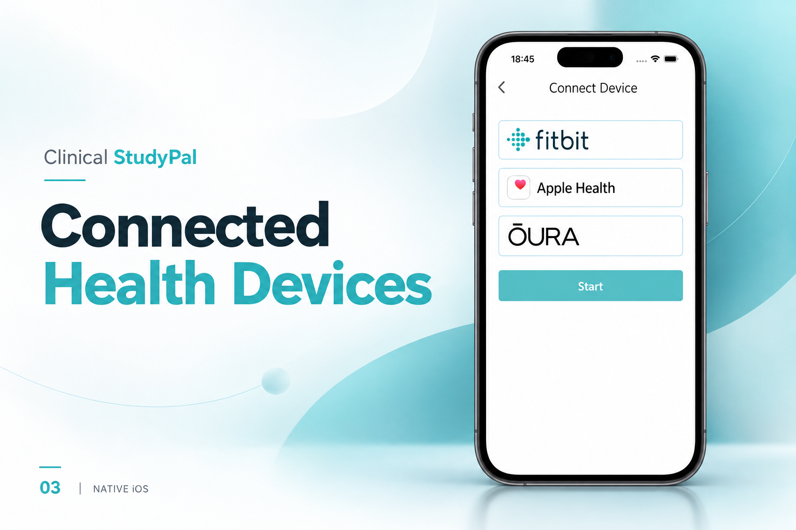

[← Back to portfolio](../../README.md#projects)

# Clinical StudyPal

Clinical research ecosystem connecting iPhone, Apple Watch, wearable sensors, and health data.

### Feature Gallery

<table>
<tr>
<td width="33%" align="center"> Study Tasks</td>
<td width="33%" align="center"> Visit Schedules</td>
<td width="33%" align="center"> Connected Health Devices</td>
</tr>
</table>

**Project artifacts:** [Cover](../../assets/projects/clinical-studypal/cover.png) · [All feature images](../../assets/projects/clinical-studypal)

### iOS & watchOS Engineer · Healthcare & Clinical Research

Clinical research ecosystem involving **iPhone, Apple Watch, wearable sensors, health information, and background synchronization**.

**Engineering Highlights**

▸ HealthKit integration
▸ Native watchOS development
▸ Heart-rate data collection
▸ Accelerometer and gyroscope processing
▸ CoreMotion integration
▸ WatchConnectivity
▸ Background synchronization
▸ CoreData persistence
▸ Production monitoring and stability

**Stack:** `Swift` `watchOS` `HealthKit` `CoreMotion` `CoreData` `WatchConnectivity`
