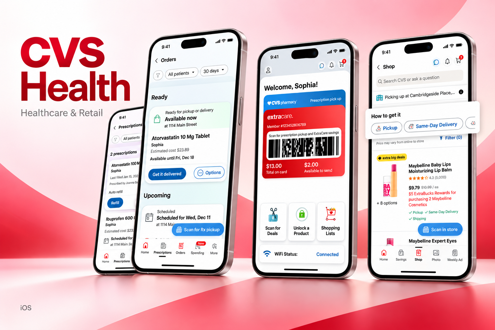
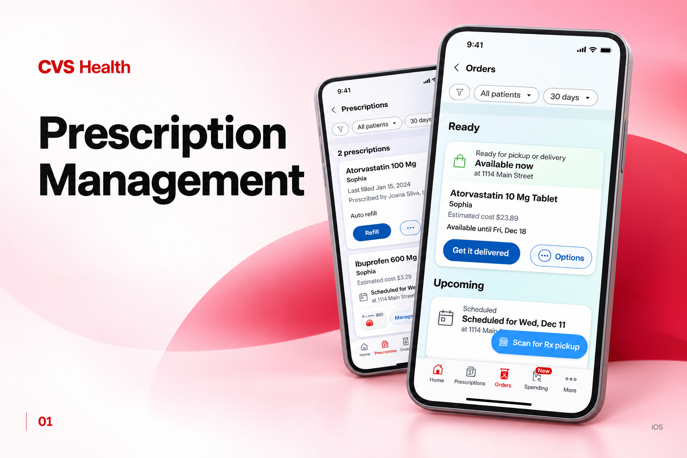
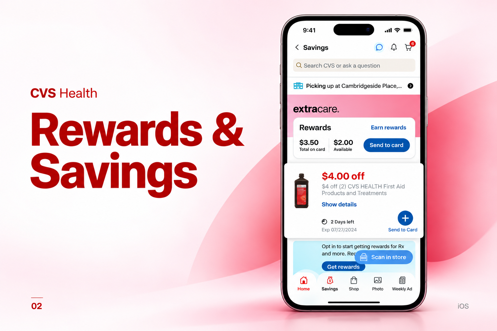
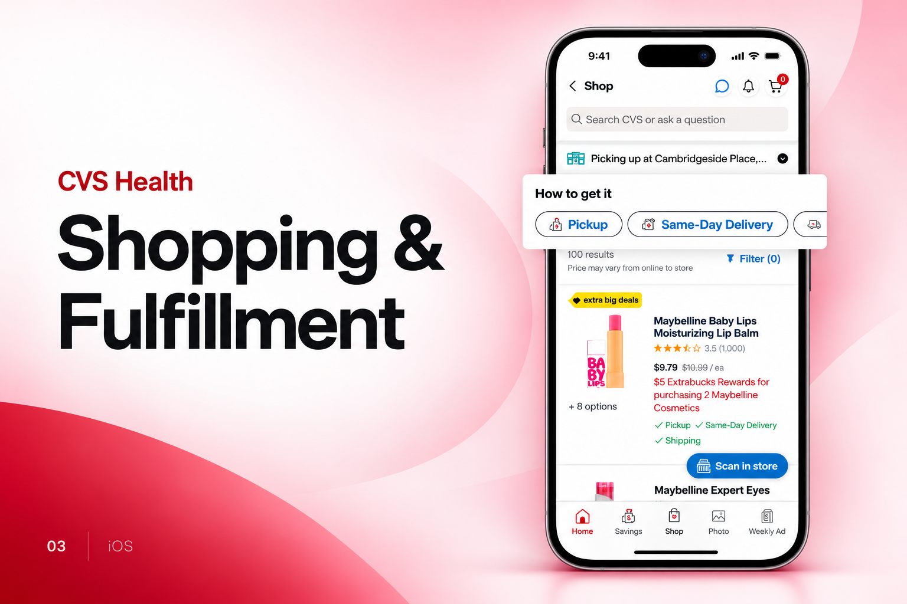

[← Back to portfolio](../../README.md#projects)

# CVS Health

Healthcare application supporting prescription management, rewards, and shopping workflows.

### Feature Gallery

<table>
<tr>
<td width="33%" align="center"> Prescription Management</td>
<td width="33%" align="center"> Rewards Savings</td>
<td width="33%" align="center"> Shopping Fulfillment</td>
</tr>
</table>

**Project artifacts:** [Cover](../../assets/projects/cvs-health/cover.png) · [All feature images](../../assets/projects/cvs-health)

**Engineering contribution:** Healthcare integrations, SDKs, and authentication.

**Store links:** [App Store](https://apps.apple.com/us/app/cvs-health/id395545555)
