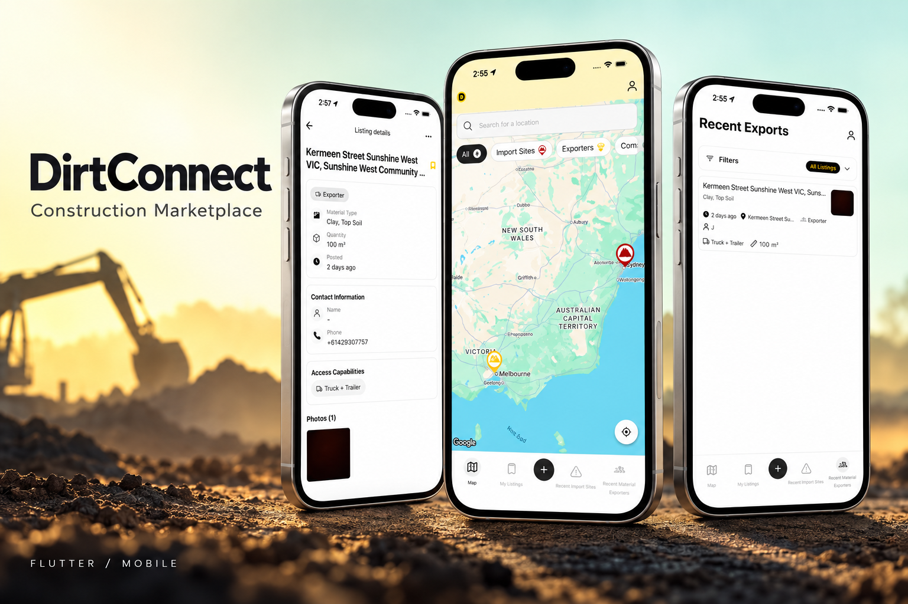
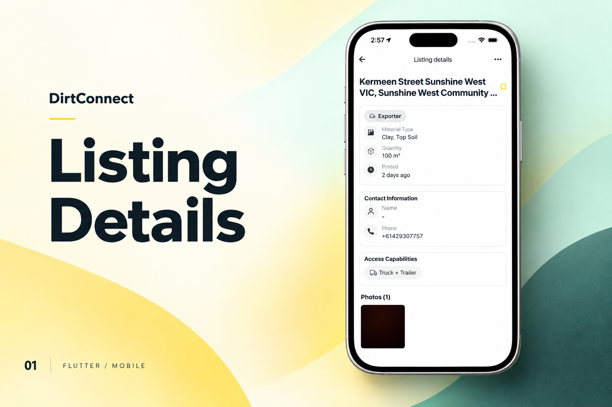
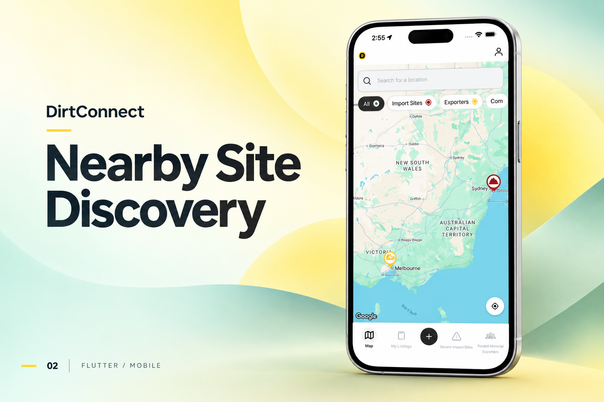
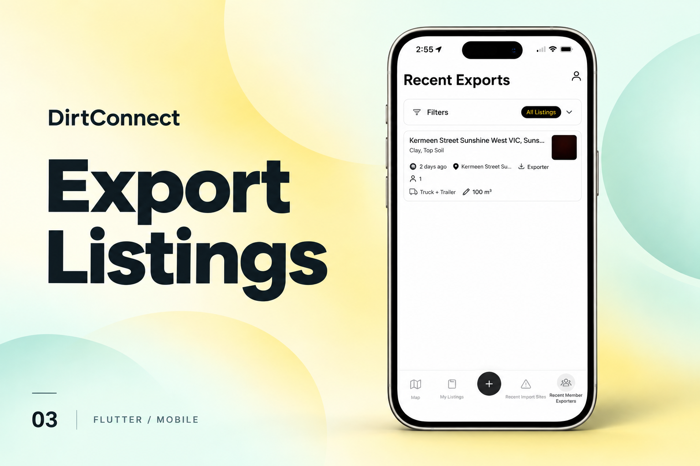

[← Back to portfolio](../../README.md#projects)

# DirtConnect

Australian construction marketplace for discovering and exchanging construction materials.

### Feature Gallery

<table>
<tr>
<td width="33%" align="center"> Listing Details</td>
<td width="33%" align="center"> Nearby Site Discovery</td>
<td width="33%" align="center"> Export Listings</td>
</tr>
</table>

**Project artifacts:** [Cover](../../assets/projects/dirtconnect/cover.png) · [All feature images](../../assets/projects/dirtconnect)

### Construction Materials Marketplace · Flutter · End-to-End Product Ownership

**DirtConnect** is an Australian construction marketplace designed to connect contractors, site managers, businesses, and material suppliers around the movement and exchange of construction materials.

I worked across the **complete product lifecycle**, from early product definition through Flutter architecture, implementation, API integration, testing, deployment, and production.

### Product Ownership

▸ Product requirements and workflow definition
▸ Flutter mobile architecture
▸ Marketplace workflows
▸ Import and export material listings
▸ Location-driven discovery
▸ Personal and business account experiences
▸ Authentication and user management
▸ Listing and image management
▸ Search and filtering
▸ Push notifications
▸ API and backend integration
▸ Production QA and stabilization
▸ Google Play delivery

**Core Stack**

`Flutter` `Dart` `REST APIs` `Firebase` `Location Services` `Marketplace Architecture`

> **Ownership:** Idea → Product Definition → Architecture → Development → API Integration → QA → Deployment → Production
