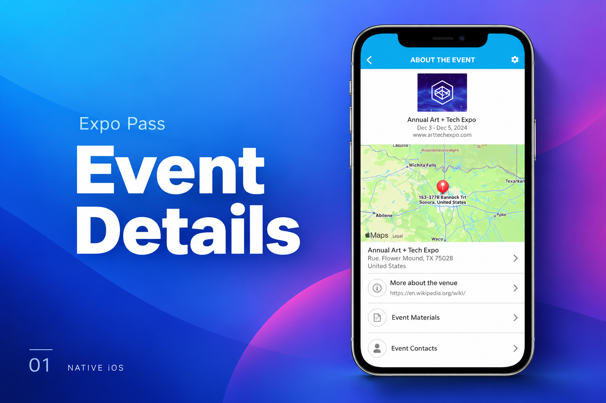
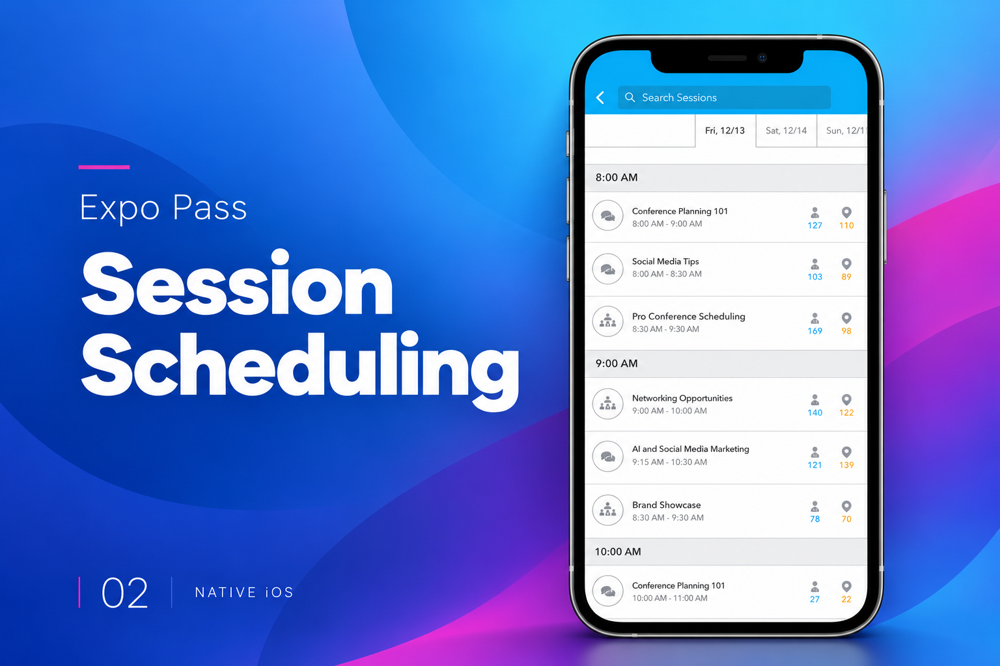
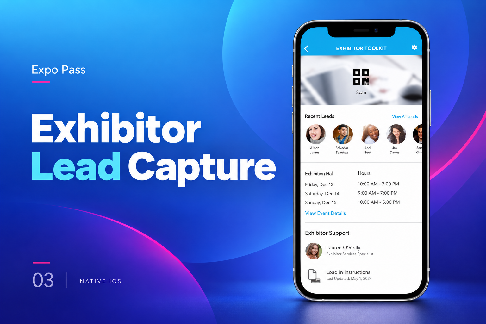

[← Back to portfolio](../../README.md#projects)

# Expo Pass

Event-management platform combining offline operations, payments, and hardware integrations.

### Feature Gallery

<table>
<tr>
<td width="33%" align="center"> Event Details</td>
<td width="33%" align="center"> Session Scheduling</td>
<td width="33%" align="center"> Exhibitor Lead Capture</td>
</tr>
</table>

**Project artifacts:** [Cover](../../assets/projects/expo-pass/cover.png) · [All feature images](../../assets/projects/expo-pass)

### Lead Mobile Developer · Native iOS

Production event-management platform involving **offline workflows, payments, event operations, and hardware integrations**.

**Engineering Highlights**

▸ Native Swift and UIKit development
▸ Offline-first workflows and local persistence
▸ Stripe Terminal integration
▸ Offline payment handling
▸ Zebra printer SDK integration
▸ Complex event-management workflows
▸ Firebase and AWS integrations
▸ Production debugging and release management

**Stack:** `Swift` `UIKit` `Realm` `Stripe Terminal` `Firebase` `AWS`
