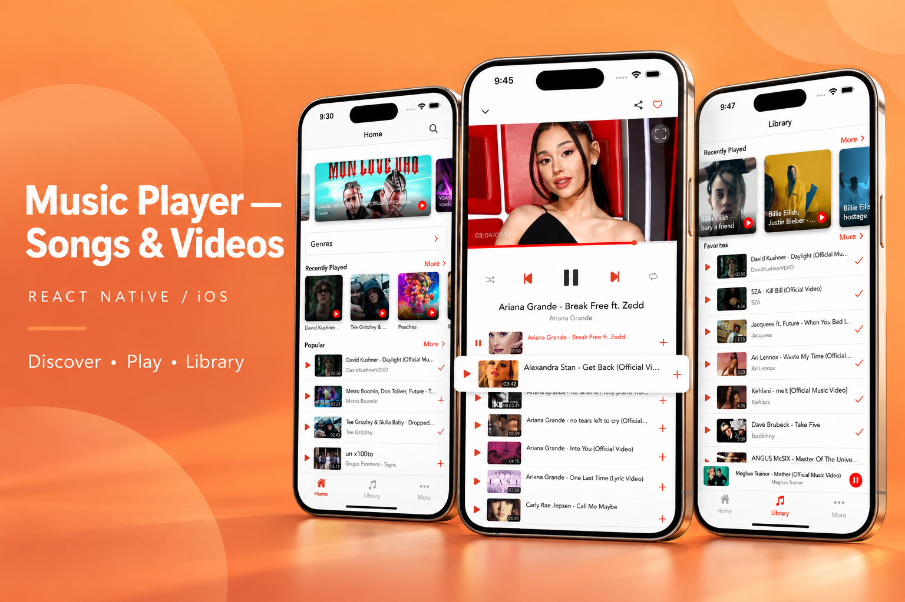
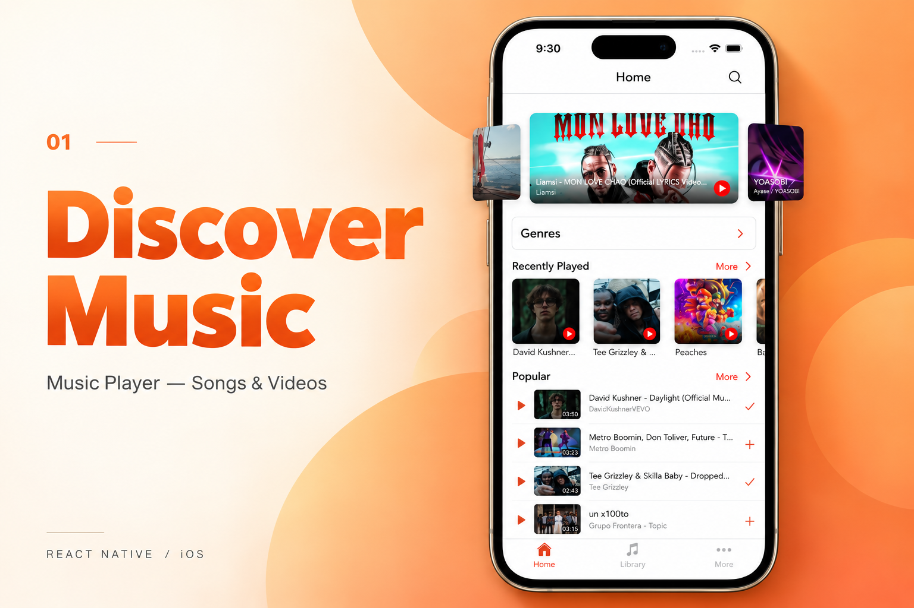
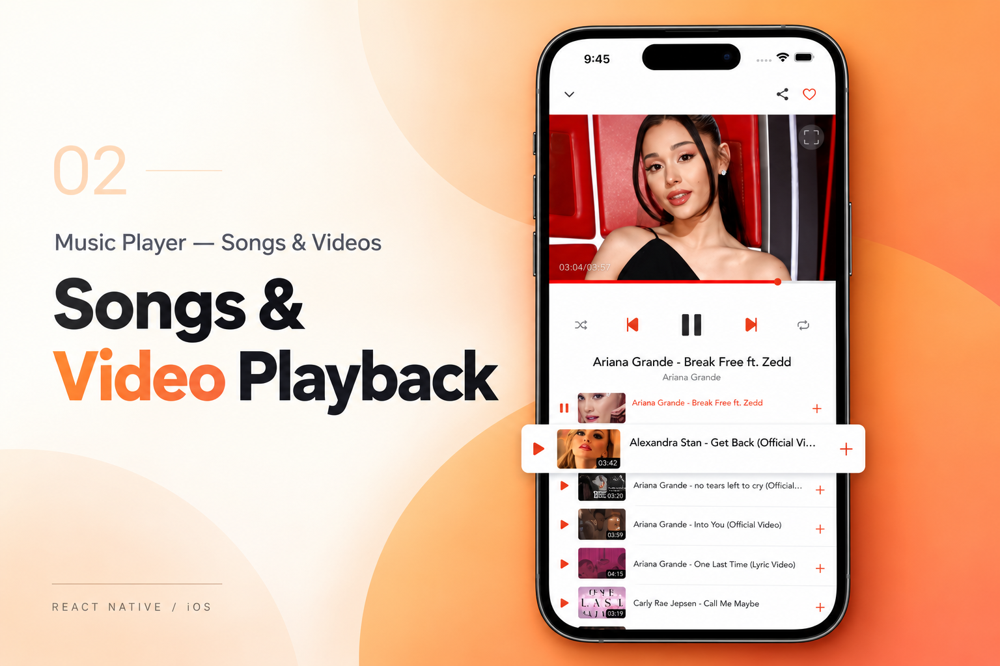
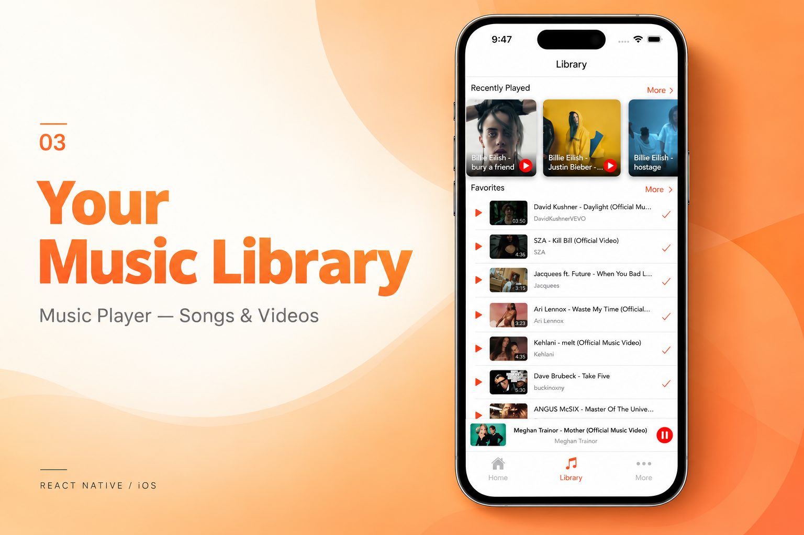

[← Back to portfolio](../../README.md#projects)

# Music Player — Songs & Videos

Music and video application with discovery, playback, and a personal media library.

### Feature Gallery

<table>
<tr>
<td width="33%" align="center"> Discover Music</td>
<td width="33%" align="center"> Songs Video Playback</td>
<td width="33%" align="center"> Your Music Library</td>
</tr>
</table>

**Project artifacts:** [Cover](../../assets/projects/music-player/cover.png) · [All feature images](../../assets/projects/music-player)

**Role:** Senior React Native Developer within the production media suite.

**Engineering work across the suite:** Frontend rebuilds, API integrations, media workflows, subscriptions, performance optimization, and App Store delivery.

**Engineering focus:** `React Native` · `API Integration` · `Media Workflows` · `Subscriptions` · `State Management` · `Performance`

**Store links:** [View on App Store](https://apps.apple.com/us/app/music-player-songs-videos/id1662272925)
