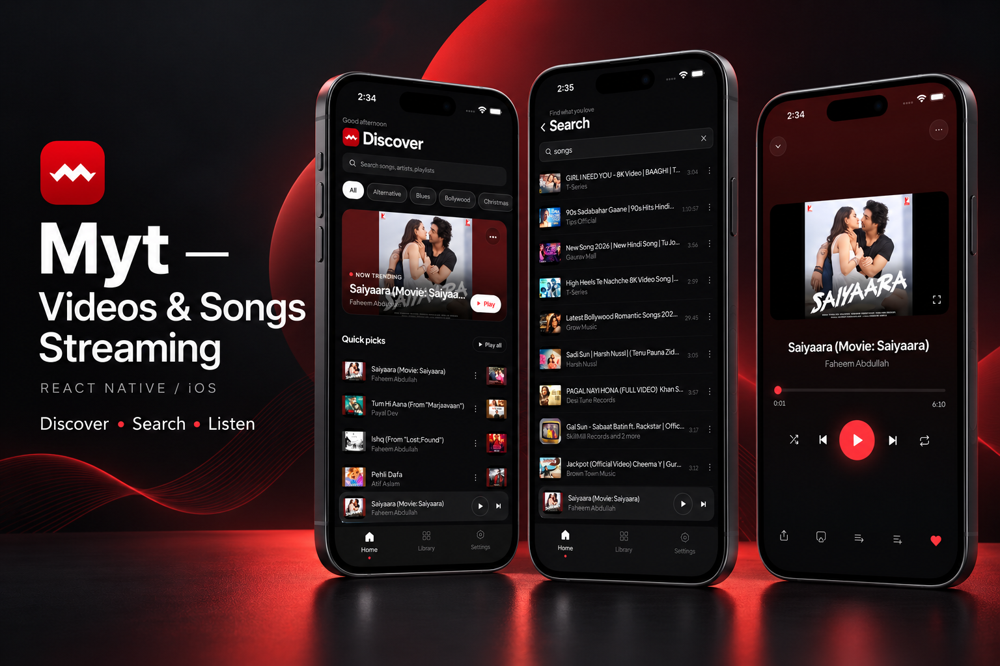
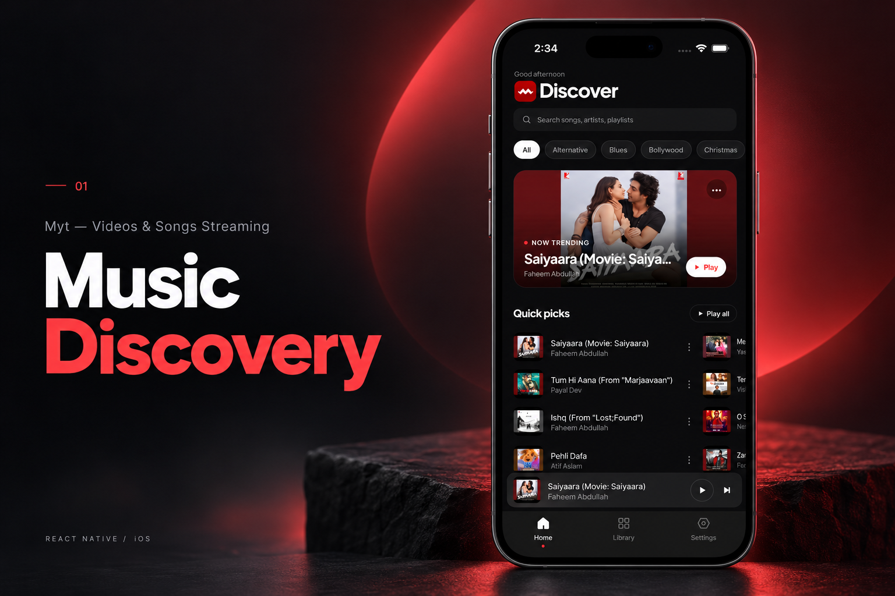
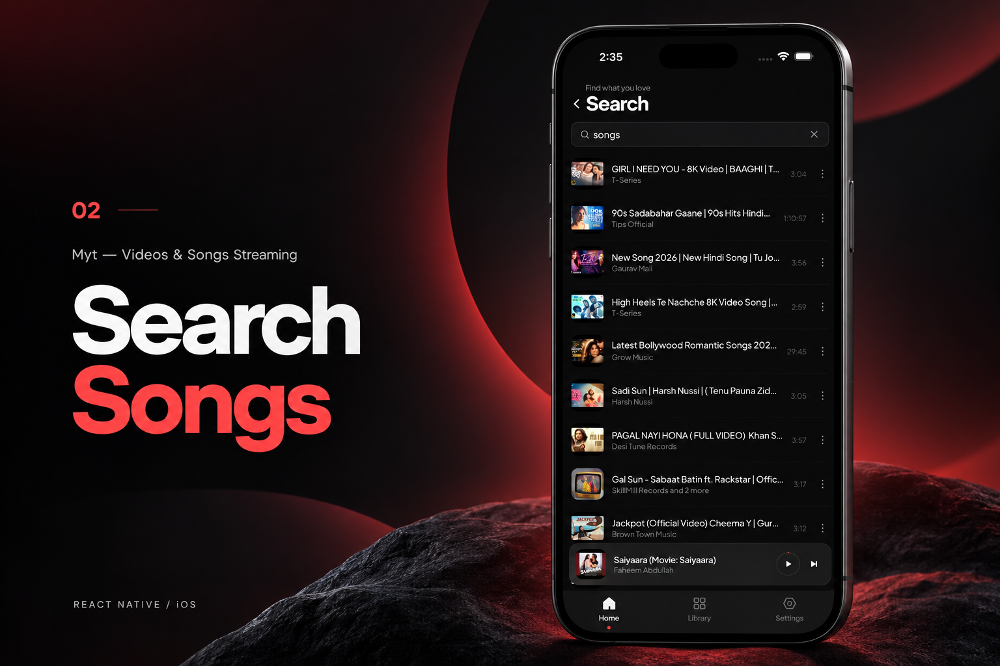
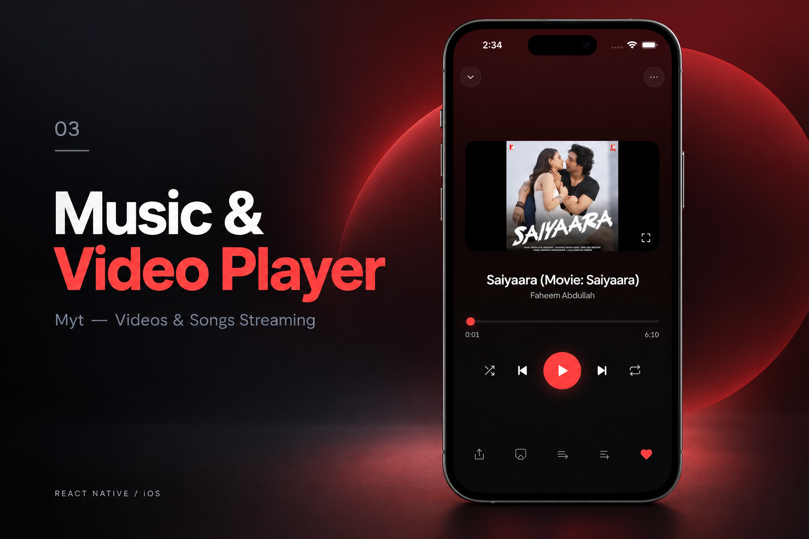

[← Back to portfolio](../../README.md#projects)

# Myt — Videos & Songs Streaming

Music and video streaming application with discovery, search, and playback.

### Feature Gallery

<table>
<tr>
<td width="33%" align="center"> Music Discovery</td>
<td width="33%" align="center"> Search Songs</td>
<td width="33%" align="center"> Music Video Player</td>
</tr>
</table>

**Project artifacts:** [Cover](../../assets/projects/myt/cover.png) · [All feature images](../../assets/projects/myt)

**Role:** Senior React Native Developer within the production media suite.

**Engineering work across the suite:** Frontend rebuilds, API integrations, media workflows, subscriptions, performance optimization, and App Store delivery.

**Engineering focus:** `React Native` · `API Integration` · `Media Workflows` · `Subscriptions` · `State Management` · `Performance`

**Store links:** [View on App Store](https://apps.apple.com/us/app/myt-videos-songs-streaming/id6738610571)
