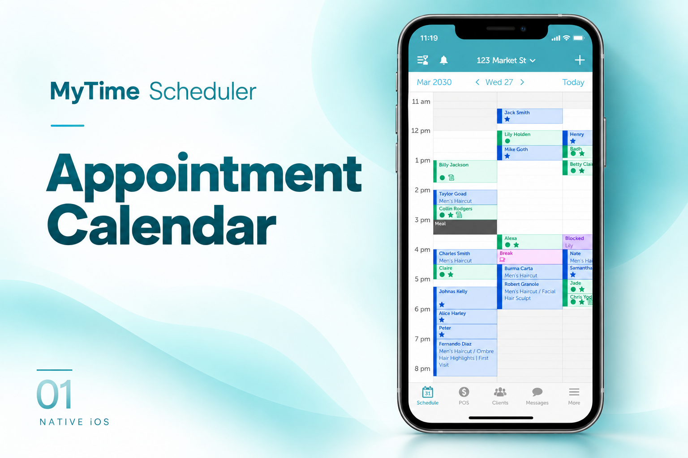
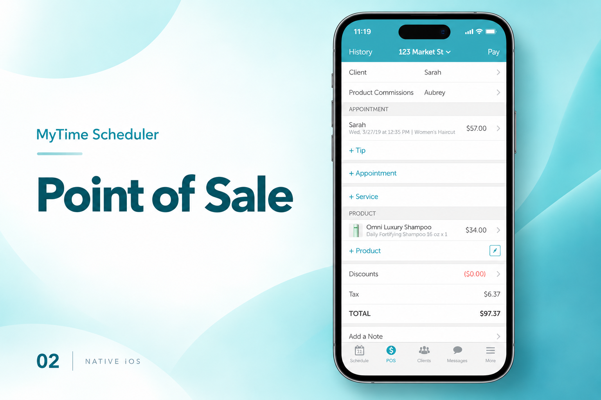
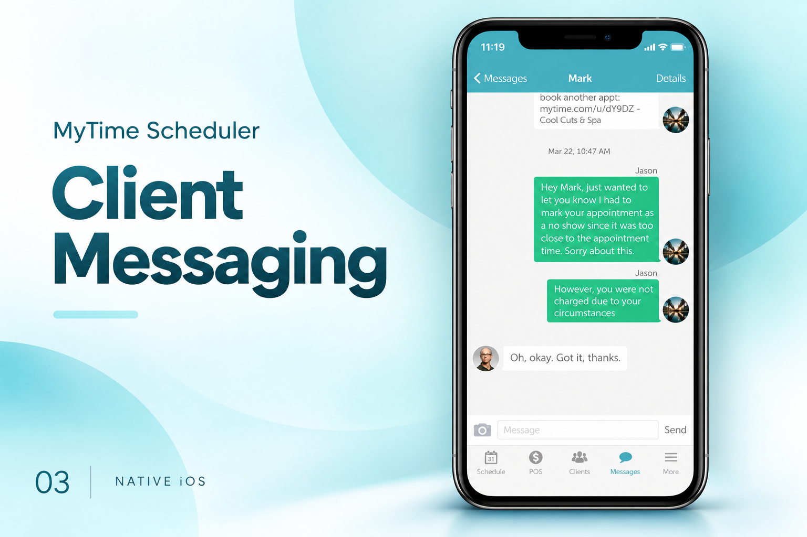

[← Back to portfolio](../../README.md#projects)

# MyTime Scheduler for Merchants

Business scheduling application with appointments, point-of-sale, and client communication.

### Feature Gallery

<table>
<tr>
<td width="33%" align="center"> Appointment Calendar</td>
<td width="33%" align="center"> Point of Sale</td>
<td width="33%" align="center"> Client Messaging</td>
</tr>
</table>

**Project artifacts:** [Cover](../../assets/projects/mytime/cover.png) · [All feature images](../../assets/projects/mytime)

**Engineering contribution:** Scheduling and business-operation workflows.

**Store links:** [App Store](https://apps.apple.com/pk/app/mytime-scheduler-for-merchants/id982024232)
