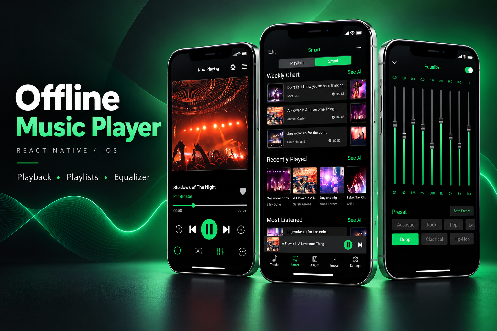
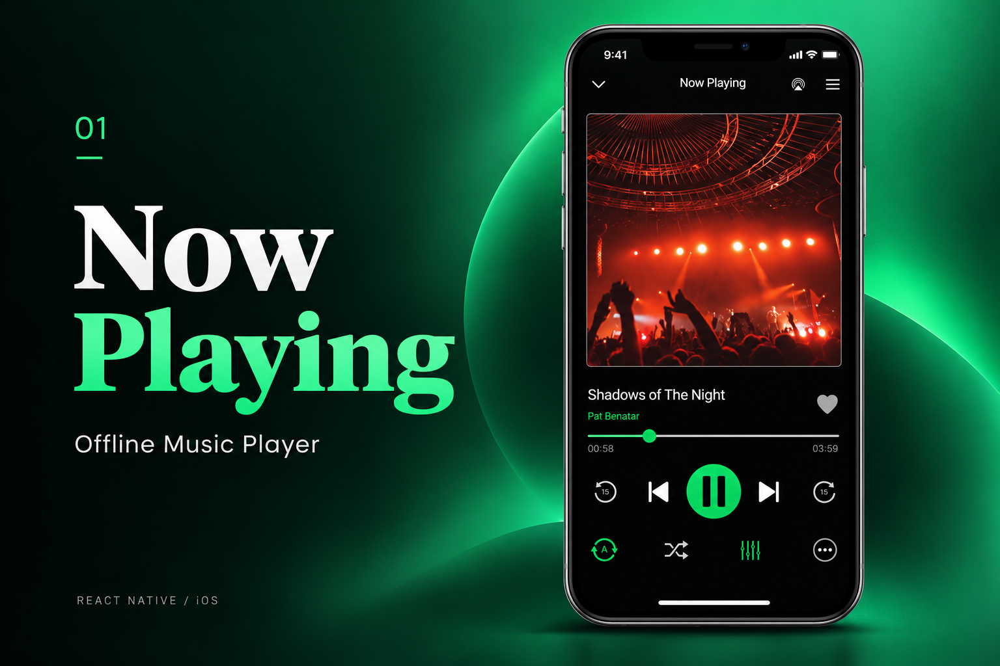
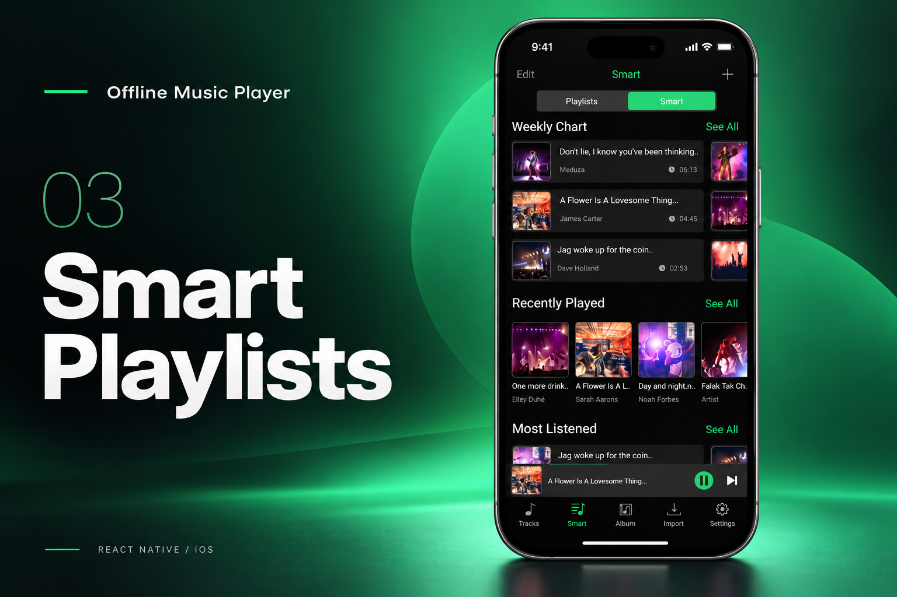
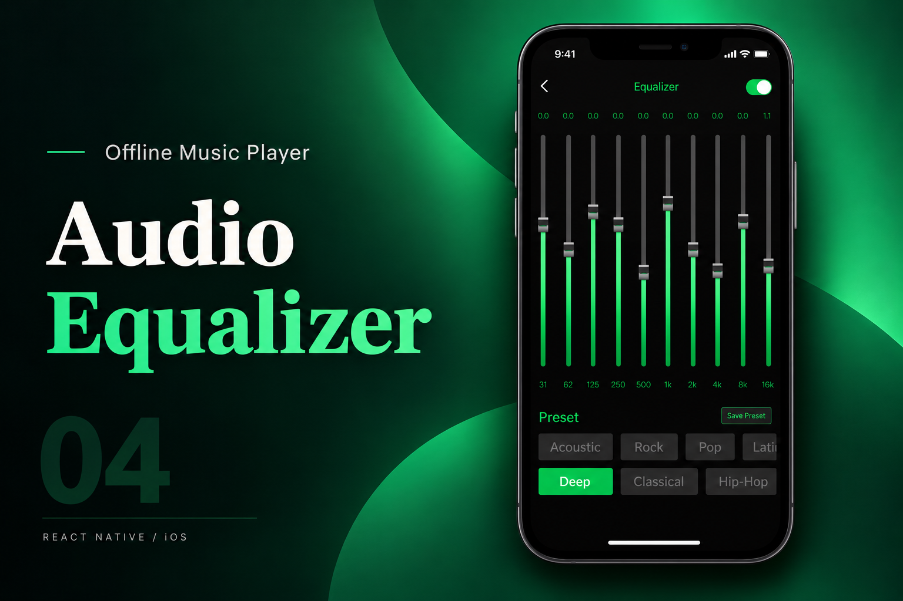

[← Back to portfolio](../../README.md#projects)

# Offline Music Player

Music application with offline listening, smart playlists, and audio equalizer controls.

### Feature Gallery

<table>
<tr>
<td width="33%" align="center"> Now Playing</td>
<td width="33%" align="center"> Smart Playlists</td>
<td width="33%" align="center"> Audio Equalizer</td>
</tr>
</table>

**Project artifacts:** [Cover](../../assets/projects/offline-music-player/cover.png) · [All feature images](../../assets/projects/offline-music-player)

**Role:** Senior React Native Developer within the production media suite.

**Engineering work across the suite:** Frontend rebuilds, API integrations, media workflows, subscriptions, performance optimization, and App Store delivery.

**Engineering focus:** `React Native` · `API Integration` · `Media Workflows` · `Subscriptions` · `State Management` · `Performance`

**Store links:** [View on App Store](https://apps.apple.com/us/app/offline-music-player/id1259949354)
