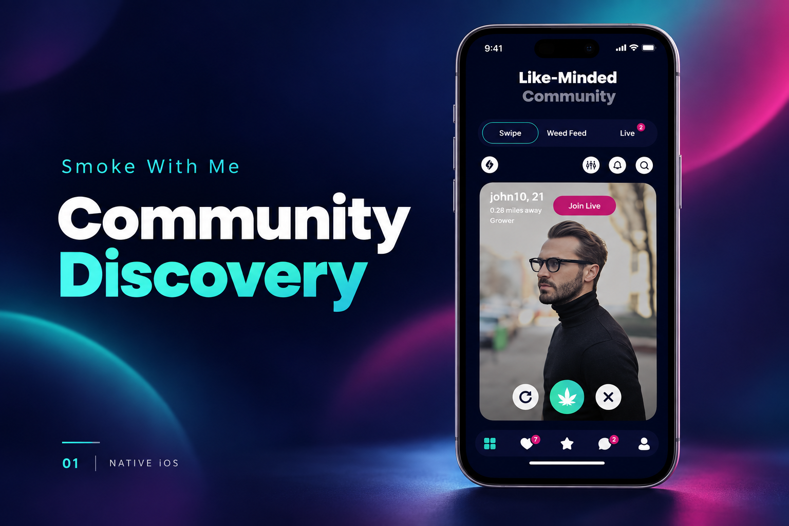
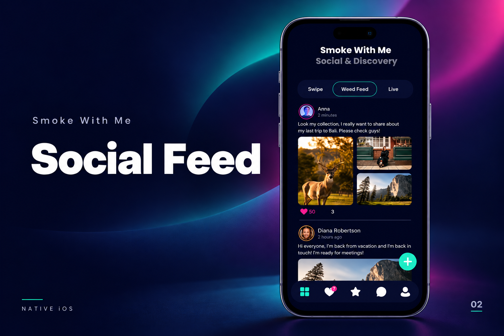
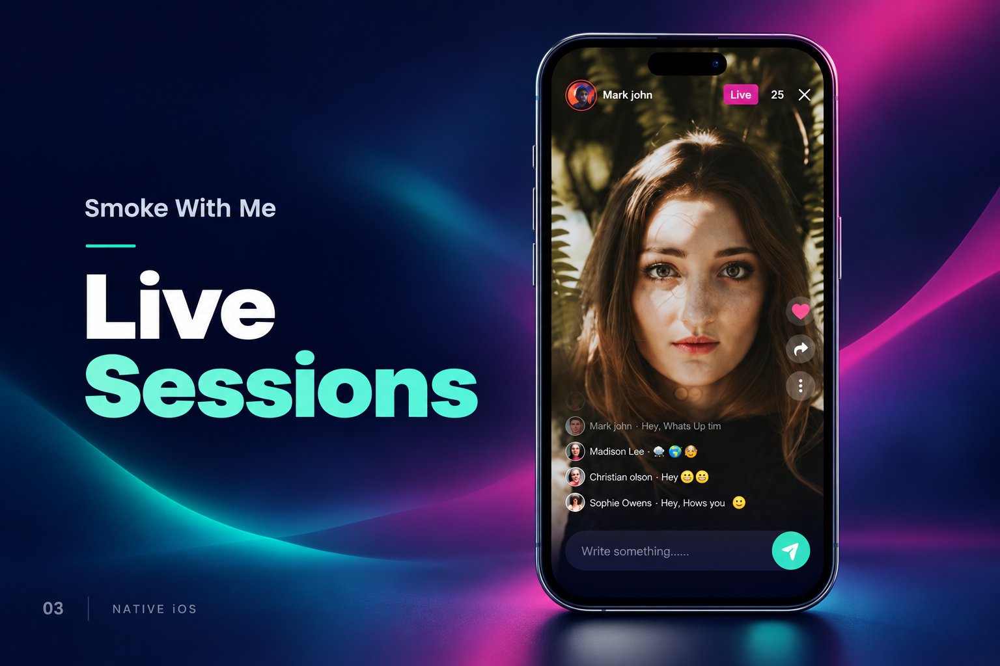

[← Back to portfolio](../../README.md#projects)

# Smoke With Me

Social networking application for community discovery, social feeds, and live sessions.

### Feature Gallery

<table>
<tr>
<td width="33%" align="center"> Community Discovery</td>
<td width="33%" align="center"> Social Feed</td>
<td width="33%" align="center"> Live Sessions</td>
</tr>
</table>

**Project artifacts:** [Cover](../../assets/projects/smoke-with-me/cover.png) · [All feature images](../../assets/projects/smoke-with-me)

**Engineering contribution:** Social networking and communication workflows.

**Store links:** [App Store](https://apps.apple.com/us/app/smoke-with-me/id6741205102)
