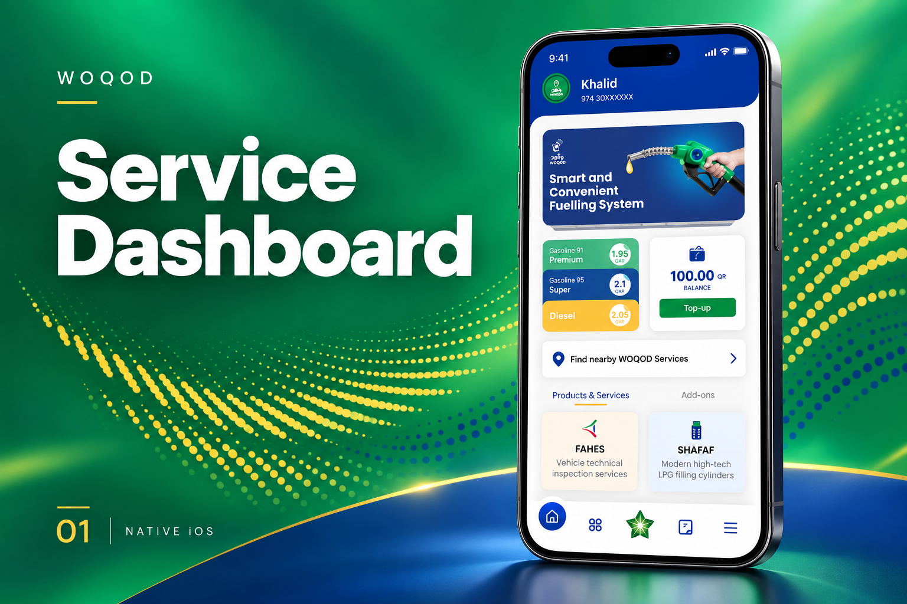
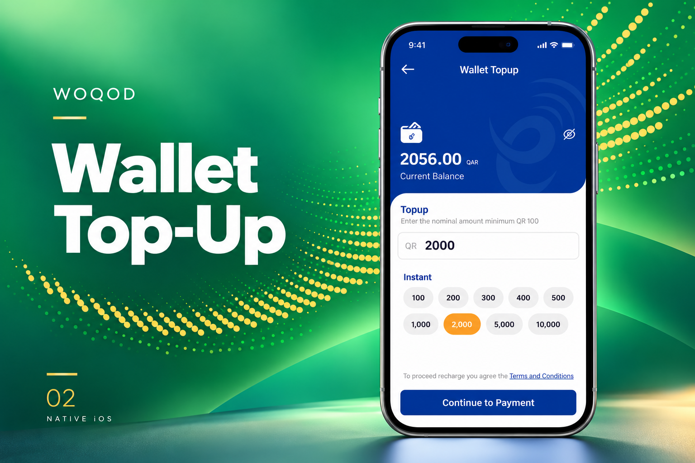
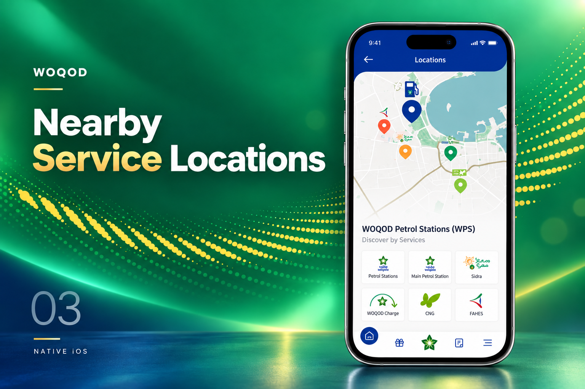

[← Back to portfolio](../../README.md#projects)

# WOQOD

Native iOS services application with service discovery and location-based experiences.

### Feature Gallery

<table>
<tr>
<td width="33%" align="center"> Service Dashboard</td>
<td width="33%" align="center"> Wallet Top Up</td>
<td width="33%" align="center"> Nearby Service Locations</td>
</tr>
</table>

**Project artifacts:** [Cover](../../assets/projects/woqod/cover.png) · [All feature images](../../assets/projects/woqod)

**Engineering contribution:** Native iOS development, services, and maps.

**Store links:** [App Store](https://apps.apple.com/us/app/woqod/id1403430375)
